# Atelier IoT : MQTT, InfluxDB, Telegraf et Grafana

[Retour au README principal](README.md)

**Atelier 1 - Concevez votre 1re plateforme IoT**

Dans un système IoT, les capteurs produisent des mesures comme la température, l’humidité ou la distance. Cet atelier suit la chaîne complète de supervision :

1. Les capteurs produisent des mesures.
2. MQTT transporte les valeurs des capteurs.
3. Telegraf lit les messages MQTT.
4. InfluxDB stocke les mesures.
5. Grafana visualise les données dans des tableaux de bord.

## Objectifs

À la fin de l’atelier, les étudiants peuvent :

- Expliquer le rôle de MQTT, Telegraf, InfluxDB et Grafana dans une chaîne de données IoT.
- Démarrer une pile IoT locale conteneurisée avec Podman Compose ou Docker Compose.
- Publier des données simulées de température, d’humidité, de distance et de détection d’objet vers des topics MQTT.
- Vérifier que les données MQTT sont collectées par Telegraf et stockées dans InfluxDB.
- Visualiser les données de capteurs en direct et historiques dans Grafana.
- Comprendre comment la configuration simulée peut être étendue à de vrais capteurs avec un Raspberry Pi.

## Déroulement de l’atelier

L’atelier est structuré en deux phases.

La **Phase 1 - Simulation** vise à construire l’architecture IoT complète avec des services conteneurisés dans un environnement local.

Cette phase permet aux participants de valider la chaîne de données de bout en bout avec des données de capteurs simulées.

La **Phase 2 - Déploiement réel** prolonge cette configuration en intégrant un Raspberry Pi avec des capteurs réels et un broker MQTT hébergé localement.

Cette phase permet l’acquisition de données en temps réel et leur visualisation dans Grafana.

Pendant la phase 2, les étudiants changent la configuration de Telegraf pour utiliser la configuration des capteurs réels. Telegraf collecte alors les données MQTT publiées par le Raspberry Pi :

```text
config/telegraf/telegraf-real-sensors.conf
```

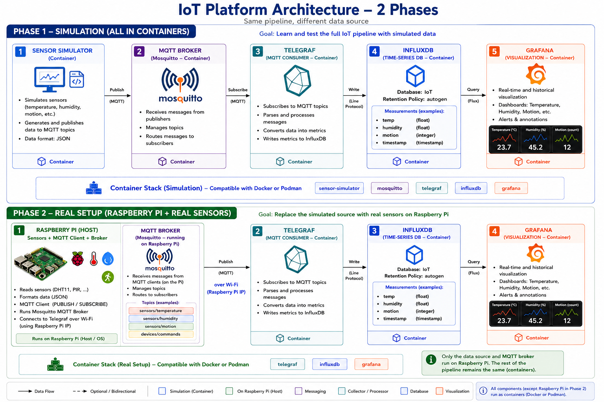

1. Présentation rapide de l’architecture IoT et des rôles de MQTT, Telegraf, InfluxDB et Grafana.
2. Installation ou vérification de l’environnement avec Podman Compose ou Docker Compose.
3. Clonage ou téléchargement du dépôt public de l’atelier.
4. Démarrage de la pile locale avec `compose.yaml`.
5. Publication de données simulées avec le conteneur `mqtt-client`.
6. Vérification du stockage des données dans InfluxDB.
7. Configuration de Grafana et import du tableau de bord.
8. Démonstration optionnelle avec Raspberry Pi et capteurs réels si le temps le permet.

## La stack IoT

### MQTT (Mosquitto) - transport des données IoT

MQTT (Message Queuing Telemetry Transport) est un protocole de messagerie léger conçu pour les réseaux à faible bande passante, à forte latence ou peu fiables. Il est très utilisé dans les systèmes IoT.

MQTT fonctionne avec un modèle publish/subscribe plutôt qu’une communication directe :

- Publisher : envoie les messages.
- Subscriber : reçoit les messages.
- Broker : serveur central qui route les messages.

Fonctionnement :

1. Les appareils se connectent à un broker MQTT.
2. Un appareil publie des données sur un topic, par exemple `home/temperature`.
3. D’autres appareils ou applications s’abonnent à ce topic.
4. Le broker transmet les messages à tous les abonnés.

Dans cet atelier, les capteurs ou le client MQTT publient des messages sur des topics comme `temp`, `humidity`, `distance` et `object`. Mosquitto est le broker MQTT.

### InfluxDB - stockage des séries temporelles

Les mesures IoT arrivent sous forme de données qui évoluent dans le temps : une valeur associée à une date et une heure. InfluxDB est une base de données optimisée pour ce type de données, appelées séries temporelles.

Dans cet atelier, InfluxDB sert à :

- Stocker les mesures comme la température, l’humidité et la distance.
- Garder un historique des valeurs.
- Permettre des requêtes comme les moyennes, les maximums et l’analyse des tendances.

### Telegraf - collecte de données

Telegraf est un agent de collecte de données souvent utilisé avec InfluxDB. Son rôle est de récupérer automatiquement des mesures provenant de différentes sources, comme des capteurs, services, fichiers logs, métriques système CPU/RAM ou messages MQTT, puis de les envoyer vers InfluxDB dans le bon format.

Il simplifie l’intégration, standardise les données et permet d’ajouter facilement de nouvelles sources sans modifier toute l’application.

### Grafana - visualisation et tableaux de bord

Grafana est un outil de visualisation qui permet de créer des dashboards avec des graphiques en temps réel, des courbes historiques et des alertes, par exemple lorsque la température dépasse `30 °C`.

## Architecture

### Architecture simplifiée

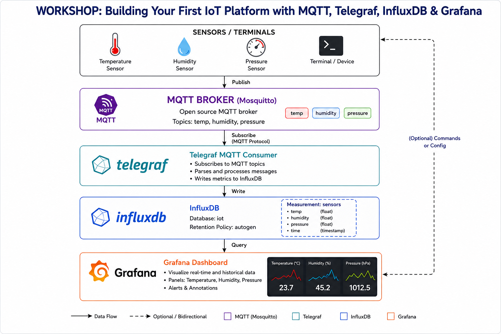

### Architecture détaillée

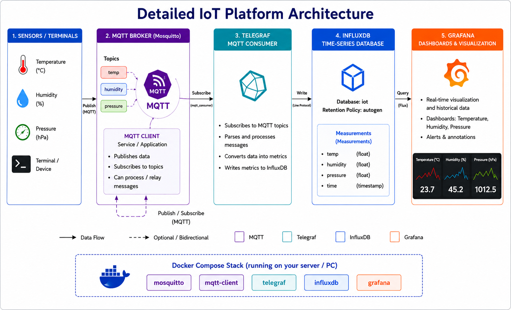

```text
Capteur ou terminal
      |
      v
Broker MQTT : topics temp, humidity, distance, object
      |
      v
Telegraf mqtt_consumer
      |
      v
Base InfluxDB : iot
      |
      v
Tableau de bord Grafana
```

## Rôles des composants

- MQTT : reçoit les messages des capteurs sur des topics comme `temp`, `humidity`, `distance` et `object`.
- Client MQTT : fournit `mosquitto_pub` et `mosquitto_sub` dans la stack Compose, afin que les étudiants n’aient pas à installer les outils MQTT localement.
- Telegraf : s’abonne aux topics MQTT et envoie les valeurs numériques vers InfluxDB.
- InfluxDB : stocke les valeurs des capteurs sous forme de séries temporelles.
- Grafana : interroge InfluxDB et affiche les tableaux de bord.
- Node-RED : outil optionnel pour étendre l’atelier avec des flux visuels IoT.

## Fichiers

- `compose.yaml` : démarre Mosquitto, le client MQTT, InfluxDB, Telegraf et Grafana.
- `config/mosquitto/mosquitto.conf` : autorise les connexions MQTT anonymes locales pour l’atelier.
- `config/telegraf/telegraf.conf` : s’abonne aux topics MQTT `temp`, `humidity`, `distance` et `object`, puis écrit les valeurs dans InfluxDB.
- `config/telegraf/telegraf-real-sensors.conf` : configuration Telegraf de la phase 2 pour les données MQTT publiées par le Raspberry Pi.
- `grafana/dashboards/iot-dashboard.json` : tableau de bord prêt à importer dans Grafana.
- `docs/images/` : contient les figures et captures d’écran du README.
- `scripts/setup.sh` : démarre la pile.
- `scripts/publish-sensor-data.sh` : publie plusieurs valeurs MQTT pour `temp`, `humidity`, `distance` et `object` depuis le conteneur `mqtt-client`.
- `archive/` : conserve les anciens exemples limités à la température.

## Prérequis

Choisissez un environnement de conteneurs avant de commencer l’atelier :

- Podman Desktop avec Podman Compose, ou
- Docker Desktop avec Docker Compose.

Références d’installation :

- Podman Desktop : <https://podman.io/docs/installation>
- Configuration de Podman Compose : <https://podman-desktop.io/docs/compose/setting-up-compose>
- Docker Desktop : <https://docs.docker.com/desktop/>
- Docker Compose : <https://docs.docker.com/compose/install/>

Outil optionnel :

- Visual Studio Code : <https://code.visualstudio.com/download>

## Comparaison entre Docker et Podman

Cet atelier peut être exécuté avec Podman Compose ou Docker Compose.

Vous avez besoin d’une seule de ces options. Les commandes sont légèrement différentes, mais les deux options utilisent le même fichier `compose.yaml` et démarrent les mêmes services IoT.

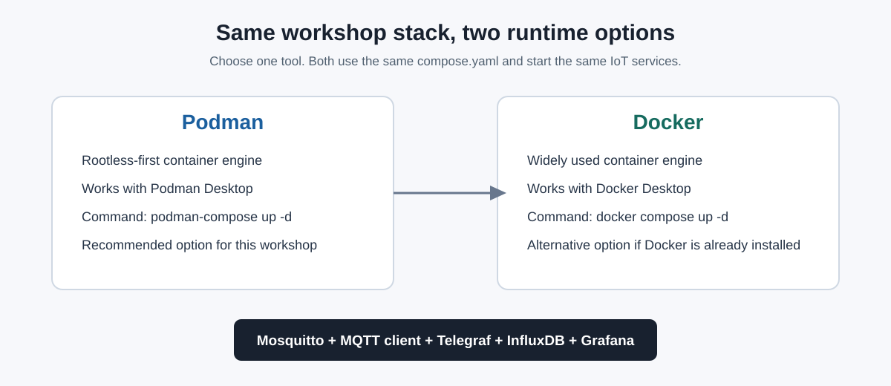

| Sujet | Podman | Docker |
| --- | --- | --- |
| Application Desktop | Podman Desktop | Docker Desktop |
| Commande Compose | `podman-compose` | `docker compose` |
| Commande de démarrage | `podman-compose up -d` | `docker compose up -d` |
| Type de moteur | Conçu pour fonctionner sans privilèges root | Basé sur le daemon Docker |
| Meilleur choix pour cet atelier | Recommandé si vous commencez de zéro | À utiliser si Docker est déjà installé |

Les instructions de l’atelier présentent Podman en premier, puis Docker. Choisissez une option et gardez le même style de commandes pour le reste de l’atelier.

### Pourquoi Podman est recommandé

Podman est recommandé pour cet atelier, car il convient mieux aux environnements académiques et d’entreprise partagés :

- Fonctionnement sans privilèges root par défaut : les conteneurs s’exécutent avec votre utilisateur, sans daemon root.
- Meilleure adaptation aux machines partagées entre plusieurs utilisateurs.
- Réduction du risque opérationnel dans les environnements académiques et d’entreprise.
- Docker peut être restreint ou interdit par les politiques de certaines universités et entreprises.

Podman conserve un workflow proche de Docker, incluant `run`, `build`, les Dockerfiles et les images Docker Hub, tout en respectant les exigences de sécurité des serveurs partagés.

### Option A : Exécuter la pile IoT avec Podman

Utilisez cette option si vous voulez faire l’atelier avec Podman.

Liens d’installation :

- Podman Desktop : <https://podman.io/docs/installation>
- Configuration de Podman Compose : <https://podman-desktop.io/docs/compose/setting-up-compose>

#### Installation macOS

Si vous utilisez Podman Desktop, installez Podman Desktop pour macOS, puis vérifiez que Podman Compose est disponible.

Si vous préférez une installation en ligne de commande, utilisez Homebrew :

```bash
brew install podman podman-compose
```

Démarrez la machine virtuelle Podman :

```bash
podman machine init
podman machine start
```

Si la machine existe déjà, exécutez seulement :

```bash
podman machine start
```

Vérifiez Podman :

```bash
podman info
podman-compose --version
```

#### Windows

1. Installez Podman Desktop pour Windows.
2. Suivez le guide de configuration de Podman Compose indiqué dans les liens ci-dessus.
3. Ouvrez PowerShell, Windows Terminal ou le terminal de VS Code.
4. Exécutez les mêmes commandes Podman que celles indiquées dans cet atelier.

Vérifiez Podman depuis PowerShell :

```powershell
podman info
podman-compose --version
```

#### Linux

Installez Podman et Podman Compose avec le gestionnaire de paquets de votre distribution.

Exemple sur Ubuntu :

```bash
sudo apt update
sudo apt install -y podman podman-compose
```

Vérifiez Podman sur Linux :

```bash
podman info
podman-compose --version
```

### Option B : Exécuter la pile IoT avec Docker

Utilisez cette option si vous voulez faire l’atelier avec Docker.

Liens d’installation :

- Docker Desktop : <https://docs.docker.com/desktop/>
- Docker Compose : <https://docs.docker.com/compose/install/>

Si vous avez installé Docker Desktop, Docker Compose est généralement déjà inclus. Vous n’avez pas besoin d’installer Docker Compose séparément ; passez directement aux vérifications de version Docker.

#### macOS

Installez Docker Desktop pour Mac, démarrez-le, puis exécutez les vérifications de version ci-dessous.

Vérifiez Docker sur macOS :

```bash
docker compose version
docker version
```

#### Windows

1. Installez Docker Desktop pour Windows.
2. Utilisez le backend WSL 2 lorsque Docker Desktop demande le moteur d’exécution.
3. Ouvrez PowerShell, Windows Terminal ou le terminal de VS Code.
4. Exécutez les mêmes commandes Docker Compose que celles indiquées dans cet atelier.

Vérifiez Docker depuis PowerShell :

```powershell
docker compose version
docker version
```

#### Linux

Installez Docker Engine et le plugin Docker Compose avec le gestionnaire de paquets de votre distribution. Assurez-vous que votre utilisateur peut exécuter les commandes Docker, ou utilisez `sudo` si votre installation l’exige.

Exemple sur Ubuntu :

```bash
sudo apt update
sudo apt install -y docker.io docker-compose-plugin
sudo systemctl enable --now docker
```

Vérifiez Docker sur Linux :

```bash
docker compose version
docker version
```

### Outils client MQTT

Aucune installation locale d’un client MQTT n’est requise. La stack Compose inclut un conteneur `mqtt-client` basé sur l’image Mosquitto. Les commandes `mosquitto_pub` et `mosquitto_sub` sont donc disponibles avec Podman Compose ou Docker Compose sur macOS, Windows et Linux.

## Étape 1 : Obtenir le dépôt

Ce dépôt est public. Vous pouvez le cloner avec Git ou le télécharger en ZIP depuis GitHub.

Option 1 : cloner avec Git :

```bash
git clone https://github.com/Synchromedia-laboratory/sdj-iot-workshop.git
cd sdj-iot-workshop
```

Option 2 : télécharger le ZIP :

1. Ouvrez <https://github.com/Synchromedia-laboratory/sdj-iot-workshop>.
2. Cliquez sur `Code`.
3. Cliquez sur `Download ZIP`.
4. Décompressez le fichier ZIP.
5. Ouvrez un terminal dans le dossier `sdj-iot-workshop` décompressé.

Exécutez toutes les commandes Compose depuis le dossier qui contient `compose.yaml`.

## Option A : Podman Compose

### Étape 2 : Démarrer la pile

Depuis ce dossier :

```bash
podman-compose up -d
```

Vérifiez que les conteneurs sont en cours d’exécution :

```bash
podman-compose ps
```

Services attendus :

- `mqtt-broker`
- `mqtt-client`
- `influxdb`
- `telegraf`
- `grafana`

La sortie du terminal devrait afficher les cinq conteneurs en cours d’exécution :

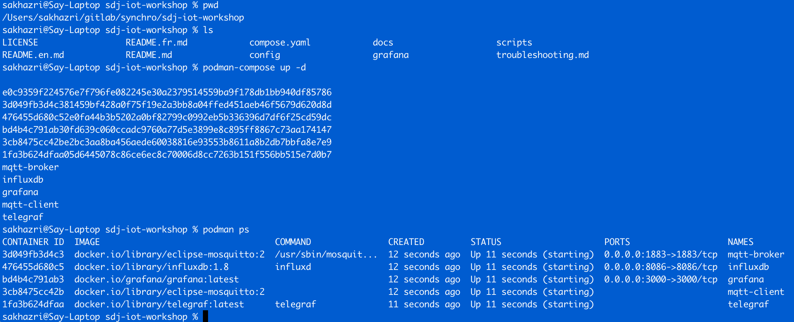

Vous pouvez aussi confirmer les mêmes conteneurs dans Podman Desktop :

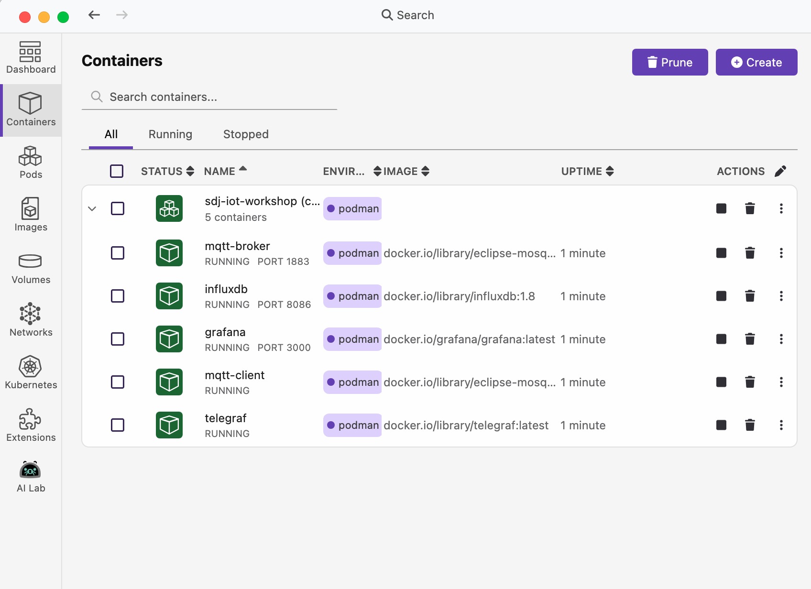

Si vous utilisez Podman, Telegraf devrait apparaître comme actif. S’il est arrêté, consultez la section dépannage pour le correctif `setpriv`.

Si la pile était déjà en cours d’exécution avant une modification de `config/telegraf/telegraf.conf`, recréez Telegraf pour charger les nouveaux topics :

```bash
podman-compose up -d --force-recreate telegraf
```

### Étape 3 : Publier des données MQTT

Méthode 1 : publier les valeurs manuellement.

Envoyer une valeur de température avec le conteneur client MQTT :

```bash
podman-compose exec mqtt-client mosquitto_pub -h mqtt-broker -p 1883 -t temp -m "25"
```

Envoyer plusieurs valeurs :

```bash
podman-compose exec mqtt-client mosquitto_pub -h mqtt-broker -p 1883 -t temp -m "22.5"
podman-compose exec mqtt-client mosquitto_pub -h mqtt-broker -p 1883 -t humidity -m "58"
podman-compose exec mqtt-client mosquitto_pub -h mqtt-broker -p 1883 -t distance -m "45"
podman-compose exec mqtt-client mosquitto_pub -h mqtt-broker -p 1883 -t object -m "1"
```

Après la publication manuelle des quatre valeurs, le tableau de bord devrait recevoir les nouveaux points :

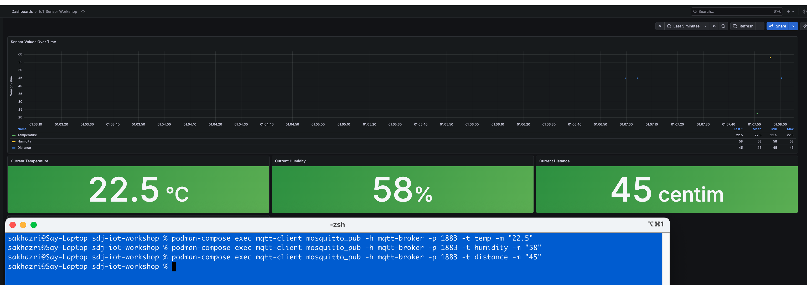

Méthode 2 : exécuter le script dans le conteneur `mqtt-client`.

Le script publie 10 séries de valeurs pour les quatre topics capteurs : `temp`, `humidity`, `distance` et `object`.

```bash
podman-compose exec mqtt-client sh /usr/local/bin/publish-sensor-data
```

Pour choisir un autre nombre de séries, ajoutez le nombre à la fin :

```bash
podman-compose exec mqtt-client sh /usr/local/bin/publish-sensor-data 20
```

Le script publie des valeurs répétées et le tableau de bord se met à jour à mesure que les données arrivent :

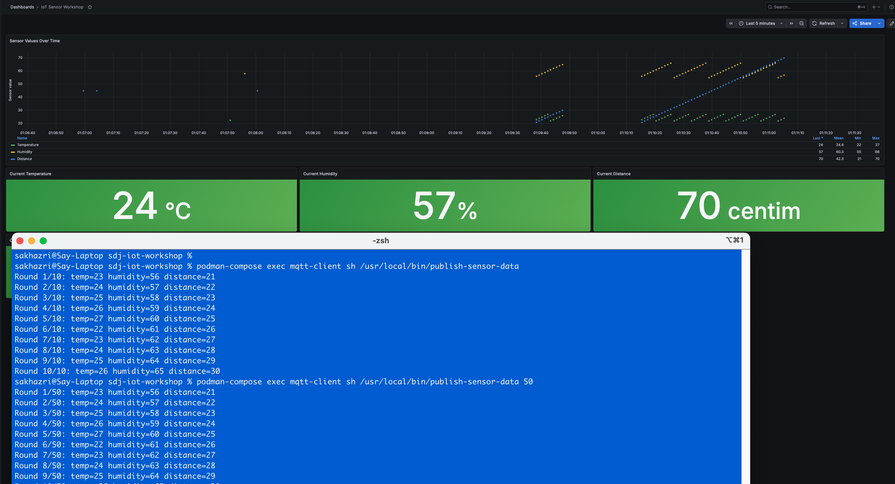

Vous pouvez aussi exécuter le script depuis le terminal du conteneur `mqtt-client` dans Podman Desktop :

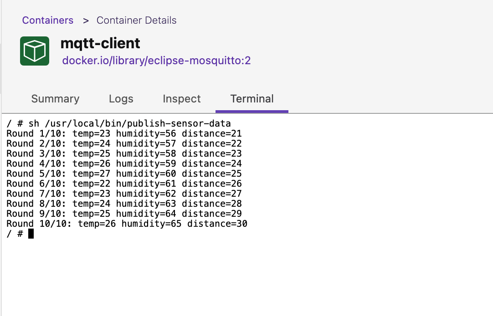

Optionnel : s’abonner dans un autre terminal pour observer les messages :

```bash
podman-compose exec mqtt-client mosquitto_sub -h mqtt-broker -p 1883 -t temp
```

Après la publication d’une valeur, Telegraf devrait l’écrire dans InfluxDB après quelques secondes.

### Étape 4 : Vérifier InfluxDB

Ouvrez le shell InfluxDB :

```bash
podman-compose exec influxdb influx
```

Exécutez :

```sql
USE iot
SHOW MEASUREMENTS
SELECT * FROM mqtt_consumer ORDER BY time DESC LIMIT 5
```

Vous devriez voir les valeurs publiées sur les topics MQTT `temp`, `humidity`, `distance` et `object`.

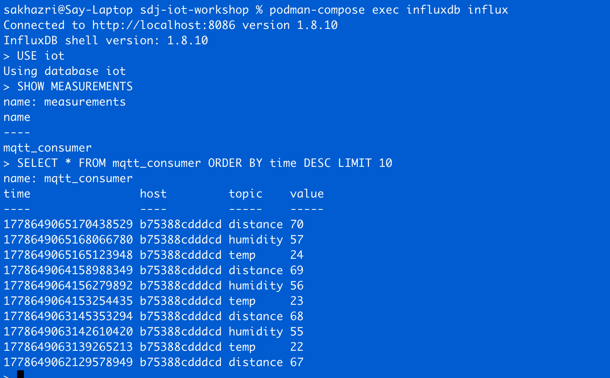

La même vérification peut aussi être exécutée depuis le terminal du conteneur `influxdb` dans Podman Desktop :

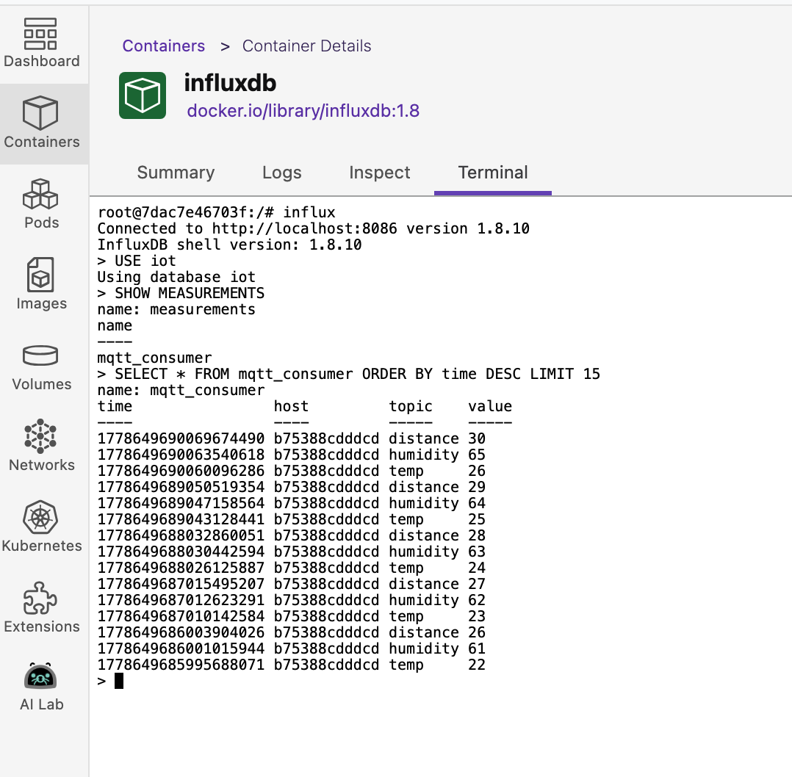

Quittez le shell :

```sql
exit
```

Vous pouvez aussi faire la vérification en une seule commande :

```bash
podman-compose exec influxdb influx -database iot -execute 'SELECT * FROM mqtt_consumer ORDER BY time DESC LIMIT 10'
```

## Option B : Docker Compose

### Étape 2 : Démarrer la pile

Depuis ce dossier :

```bash
docker compose up -d
```

Vérifiez que les conteneurs sont en cours d’exécution :

```bash
docker compose ps
```

Services attendus :

- `mqtt-broker`
- `mqtt-client`
- `influxdb`
- `telegraf`
- `grafana`

Si la pile était déjà en cours d’exécution avant une modification de `config/telegraf/telegraf.conf`, recréez Telegraf pour charger les nouveaux topics :

```bash
docker compose up -d --force-recreate telegraf
```

### Étape 3 : Publier des données MQTT

Méthode 1 : publier les valeurs manuellement.

Envoyer une valeur de température avec le conteneur client MQTT :

```bash
docker compose exec mqtt-client mosquitto_pub -h mqtt-broker -p 1883 -t temp -m "25"
```

Envoyer plusieurs valeurs :

```bash
docker compose exec mqtt-client mosquitto_pub -h mqtt-broker -p 1883 -t temp -m "22.5"
docker compose exec mqtt-client mosquitto_pub -h mqtt-broker -p 1883 -t humidity -m "58"
docker compose exec mqtt-client mosquitto_pub -h mqtt-broker -p 1883 -t distance -m "45"
docker compose exec mqtt-client mosquitto_pub -h mqtt-broker -p 1883 -t object -m "1"
```

Méthode 2 : exécuter le script dans le conteneur `mqtt-client`.

Le script publie 10 séries de valeurs pour les quatre topics capteurs : `temp`, `humidity`, `distance` et `object`.

```bash
docker compose exec mqtt-client sh /usr/local/bin/publish-sensor-data
```

Pour choisir un autre nombre de séries, ajoutez le nombre à la fin :

```bash
docker compose exec mqtt-client sh /usr/local/bin/publish-sensor-data 20
```

Optionnel : s’abonner dans un autre terminal pour observer les messages :

```bash
docker compose exec mqtt-client mosquitto_sub -h mqtt-broker -p 1883 -t temp
```

Après la publication d’une valeur, Telegraf devrait l’écrire dans InfluxDB après quelques secondes.

### Étape 4 : Vérifier InfluxDB

Ouvrez le shell InfluxDB :

```bash
docker compose exec influxdb influx
```

Exécutez :

```sql
USE iot
SHOW MEASUREMENTS
SELECT * FROM mqtt_consumer ORDER BY time DESC LIMIT 5
```

Vous devriez voir les valeurs publiées sur les topics MQTT `temp`, `humidity`, `distance` et `object`.

Quittez le shell :

```sql
exit
```

Vous pouvez aussi faire la vérification en une seule commande :

```bash
docker compose exec influxdb influx -database iot -execute 'SELECT * FROM mqtt_consumer ORDER BY time DESC LIMIT 10'
```

## Étape 5 : Configurer Grafana

Ouvrez Grafana :

```text
http://localhost:3000
```

Connexion :

```text
Username: admin
Password: admin
```

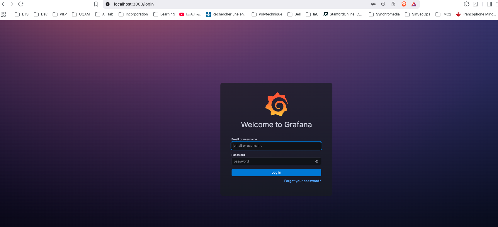

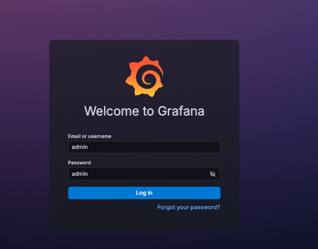

Grafana peut demander de changer le mot de passe. Pour un atelier en classe, vous pouvez l’ignorer.

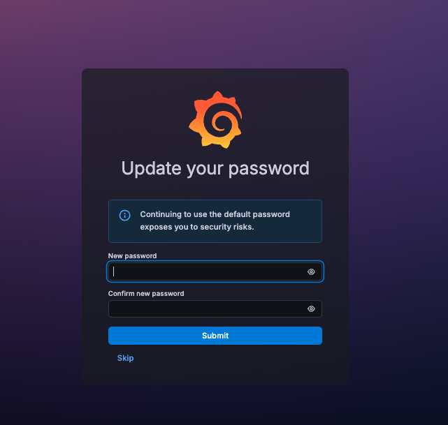

Après la connexion, Grafana s’ouvre sur la page d’accueil :

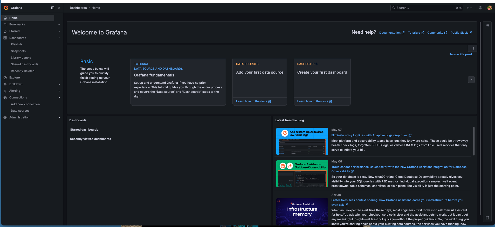

Ajoutez une source de données InfluxDB :

1. Dans le menu de gauche, ouvrez `Connections`.
2. Cliquez sur `Data sources`.
3. Cliquez sur `Add new data source`.
4. Sélectionnez `InfluxDB`.
5. Remplissez les champs ci-dessous.

- Type : `InfluxDB`
- Query language : `InfluxQL`
- URL : `http://influxdb:8086`
- Database : `iot`
- User : laissez vide
- Password : laissez vide

Cliquez sur `Save & test`.

Les paramètres de la source de données doivent correspondre au service InfluxDB utilisé par la pile Compose :

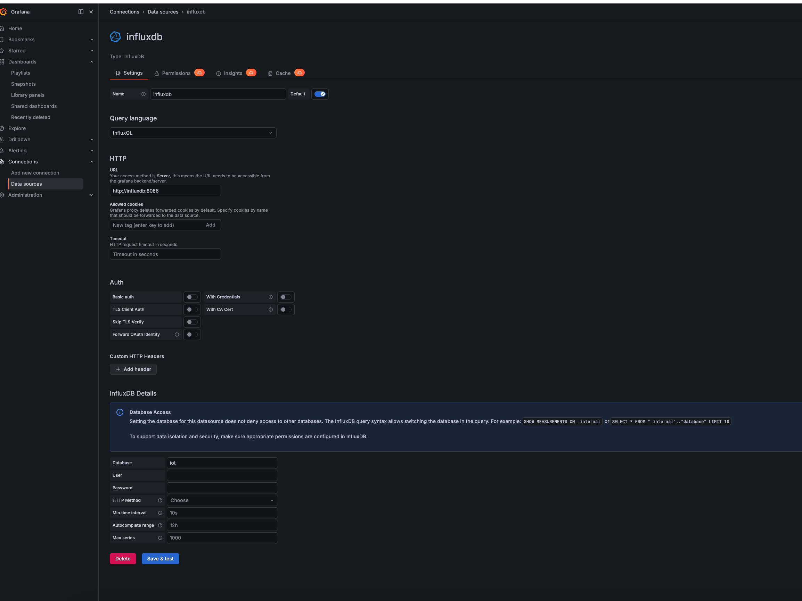

Après l’enregistrement, Grafana devrait confirmer que la source de données fonctionne :

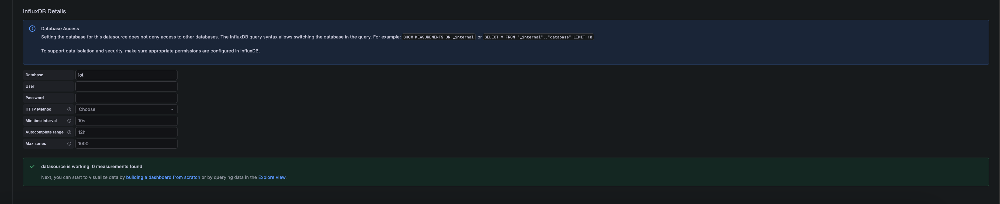

Important : utilisez `http://influxdb:8086` seulement dans Grafana. Grafana s’exécute dans le même réseau de conteneurs qu’InfluxDB, donc il peut joindre le service `influxdb`. Depuis votre navigateur ou votre terminal sur la machine hôte, utilisez plutôt `localhost:8086`.

Pour tester InfluxDB depuis votre terminal :

```bash
curl -i http://localhost:8086/ping
```

Une instance InfluxDB fonctionnelle retourne généralement :

```text
HTTP/1.1 204 No Content
```

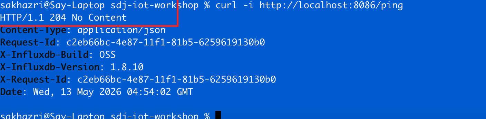

## Étape 6 : Importer le tableau de bord prêt à l’emploi

Grafana peut importer le tableau de bord depuis `grafana/dashboards/iot-dashboard.json`.

Dans Grafana :

1. Ouvrez `Dashboards`.
2. Cliquez sur `New`.
3. Cliquez sur `Import`.
4. Téléversez `grafana/dashboards/iot-dashboard.json`.
5. Sélectionnez la source de données InfluxDB créée à l’étape 5.
6. Cliquez sur `Import`.

L’option d’importation est disponible dans le menu `New` de la page Dashboards :

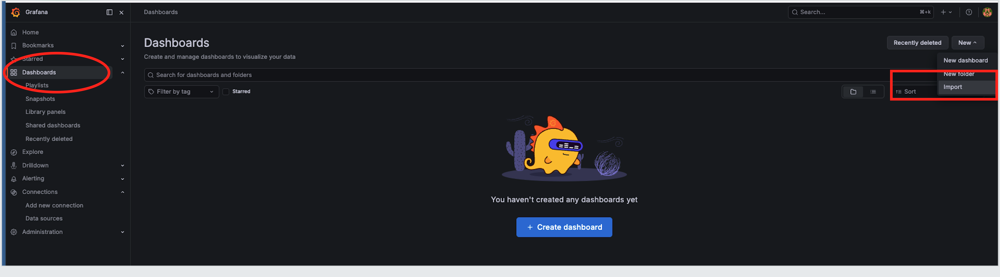

Le tableau de bord importé contient :

- Les valeurs des capteurs dans le temps.
- La température courante.
- L’humidité courante.
- La distance courante.
- L’état de détection d’objet courant.

Publiez de nouvelles valeurs MQTT et rafraîchissez le tableau de bord.

## Optionnel : Créer un tableau de bord manuellement

Créez un nouveau tableau de bord et ajoutez un panneau.

Utilisez cette requête InfluxQL :

```sql
SELECT mean("value") FROM "mqtt_consumer" WHERE $timeFilter GROUP BY time($__interval) fill(null)
```

Paramètres suggérés pour le panneau :

- Visualization : `Time series`
- Title : `Sensor Values`

Publiez de nouvelles valeurs MQTT et rafraîchissez le tableau de bord.

## Optionnel : Phase 2 avec déploiement réel

Utilisez cette partie seulement si le temps le permet et si la chaîne de simulation fonctionne déjà.

Pendant la phase 2, le Raspberry Pi publie les valeurs de vrais capteurs vers le broker MQTT de la pile de l’atelier. Telegraf collecte ensuite ces messages MQTT et les écrit dans InfluxDB, afin que Grafana puisse afficher les données réelles en direct.

### Architecture du déploiement réel

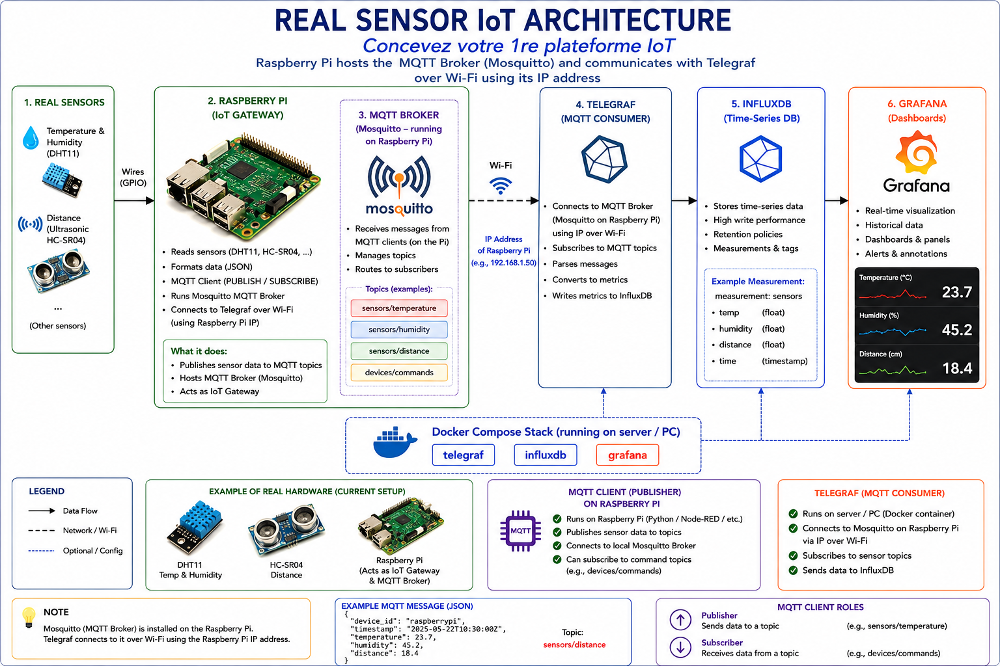

### Montage des capteurs avec Raspberry Pi

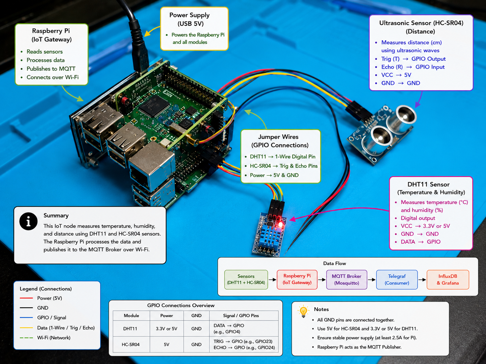

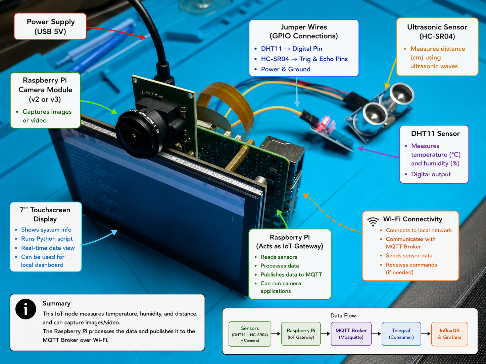

### 1. Passer Telegraf à la configuration des capteurs réels

La configuration de la phase 2 est :

```text
config/telegraf/telegraf-real-sensors.conf
```

Remplacez la configuration Telegraf active par la configuration des capteurs réels :

```bash
cp config/telegraf/telegraf.conf config/telegraf/telegraf-simulation.conf
cp config/telegraf/telegraf-real-sensors.conf config/telegraf/telegraf.conf
```

Recréez Telegraf pour recharger la configuration.

Avec Podman Compose :

```bash
podman-compose up -d --force-recreate telegraf
```

Avec Docker Compose :

```bash
docker compose up -d --force-recreate telegraf
```

### 2. Trouver l’adresse IP de l’ordinateur

Le Raspberry Pi doit publier les messages MQTT vers l’adresse IP de l’ordinateur qui exécute la pile de l’atelier.

Sur macOS :

```bash
ipconfig getifaddr en0
```

Sur Linux :

```bash
hostname -I
```

Sur Windows PowerShell :

```powershell
ipconfig
```

Utilisez l’adresse IP qui se trouve sur le même réseau que le Raspberry Pi.

### 3. Publier les données réelles depuis le Raspberry Pi

Le Raspberry Pi doit publier des charges utiles numériques vers les mêmes topics MQTT que dans la phase 1 :

- `temp`
- `humidity`
- `distance`
- `object`

Exemples de commandes de test depuis le Raspberry Pi :

```bash
mosquitto_pub -h <adresse-ip-ordinateur> -p 1883 -t temp -m "24.6"
mosquitto_pub -h <adresse-ip-ordinateur> -p 1883 -t humidity -m "57"
mosquitto_pub -h <adresse-ip-ordinateur> -p 1883 -t distance -m "42"
mosquitto_pub -h <adresse-ip-ordinateur> -p 1883 -t object -m "1"
```

La charge utile doit être uniquement un nombre, car Telegraf est configuré avec `data_format = "value"` et `data_type = "float"`.

Le Raspberry Pi peut aussi afficher les valeurs des capteurs localement pendant leur publication vers MQTT :

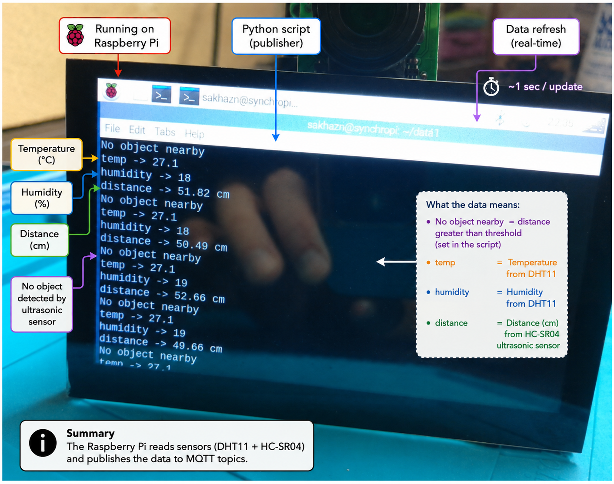

### 4. Vérifier la chaîne de données réelles

Abonnez-vous à tous les topics MQTT depuis le conteneur `mqtt-client` :

```bash
podman-compose exec mqtt-client mosquitto_sub -h mqtt-broker -p 1883 -t '#' -v
```

Si vous utilisez Docker Compose :

```bash
docker compose exec mqtt-client mosquitto_sub -h mqtt-broker -p 1883 -t '#' -v
```

Lorsque le Raspberry Pi publie les données, vous devriez voir des messages comme :

```text
temp 24.6
humidity 57
distance 42
object 1
```

Rafraîchissez ensuite Grafana pour voir les données réelles en direct.

### 5. Visualiser le tableau de bord des capteurs réels dans Grafana

Le tableau de bord devrait afficher les données en direct extraites des capteurs réels à travers la chaîne Raspberry Pi et MQTT.

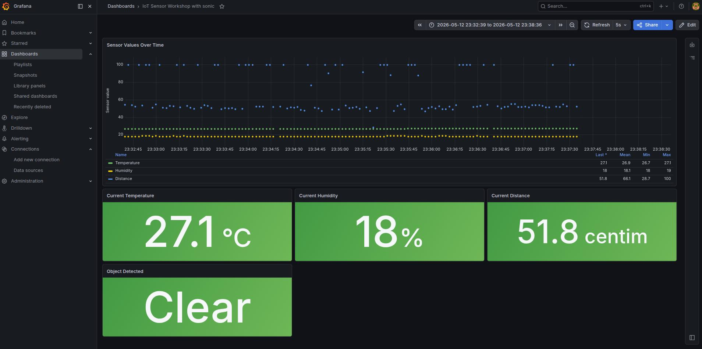

## Étape 7 : Arrêter la pile

```bash
podman-compose down
```

Si vous utilisez Docker Compose :

```bash
docker compose down
```

Pour supprimer aussi les données stockées :

```bash
podman-compose down -v
docker compose down -v
```

## Dépannage

Si Grafana n’affiche pas de données :

### 1. Vérifier que les conteneurs sont en cours d’exécution

Avec Docker Compose :

```bash
docker compose ps
```

Avec Podman Compose :

```bash
podman-compose ps
```

Services attendus :

- `mqtt-broker`
- `mqtt-client`
- `influxdb`
- `telegraf`
- `grafana`

Si `telegraf` est arrêté, vérifiez ses logs :

```bash
docker compose logs telegraf
```

### 2. Confirmer que les messages MQTT atteignent les topics des capteurs

Ouvrez un terminal et abonnez-vous à tous les topics MQTT :

```bash
docker compose exec mqtt-client mosquitto_sub -h mqtt-broker -p 1883 -t '#' -v
```

Ouvrez un autre terminal et publiez des valeurs :

```bash
docker compose exec mqtt-client mosquitto_pub -h mqtt-broker -p 1883 -t temp -m "25"
docker compose exec mqtt-client mosquitto_pub -h mqtt-broker -p 1883 -t humidity -m "58"
docker compose exec mqtt-client mosquitto_pub -h mqtt-broker -p 1883 -t distance -m "45"
docker compose exec mqtt-client mosquitto_pub -h mqtt-broker -p 1883 -t object -m "1"
```

Sortie attendue dans le terminal abonné :

```text
temp 25
humidity 58
distance 45
object 1
```

Si vous voyez ces messages, MQTT fonctionne.

### 3. Confirmer que les valeurs sont des nombres valides

Telegraf est configuré avec :

```toml
data_format = "value"
data_type = "float"
```

Cela signifie que la charge utile MQTT doit être uniquement un nombre.

Charges utiles valides :

```text
25
22.5
30.1
```

Charges utiles invalides :

```text
temperature=25
{"temperature":25}
25 C
```

Publiez une valeur de test valide :

```bash
docker compose exec mqtt-client mosquitto_pub -h mqtt-broker -p 1883 -t temp -m "25.5"
docker compose exec mqtt-client mosquitto_pub -h mqtt-broker -p 1883 -t humidity -m "58"
docker compose exec mqtt-client mosquitto_pub -h mqtt-broker -p 1883 -t distance -m "45"
docker compose exec mqtt-client mosquitto_pub -h mqtt-broker -p 1883 -t object -m "1"
```

### 4. Confirmer qu’InfluxDB contient des données

```bash
docker compose exec influxdb influx -database iot -execute 'SELECT * FROM mqtt_consumer ORDER BY time DESC LIMIT 10'
```

La sortie attendue contient des lignes avec une colonne `value` :

```text
name: mqtt_consumer
time                topic value
----                ----- -----
...                 temp  25.5
...                 humidity 58
...                 distance 45
...                 object 1
```

S’il n’y a pas de données, redémarrez Telegraf et publiez à nouveau :

```bash
docker compose restart telegraf
docker compose exec mqtt-client mosquitto_pub -h mqtt-broker -p 1883 -t temp -m "26"
docker compose exec mqtt-client mosquitto_pub -h mqtt-broker -p 1883 -t humidity -m "60"
docker compose exec mqtt-client mosquitto_pub -h mqtt-broker -p 1883 -t distance -m "42"
docker compose exec mqtt-client mosquitto_pub -h mqtt-broker -p 1883 -t object -m "1"
```

Puis vérifiez encore InfluxDB :

```bash
docker compose exec influxdb influx -database iot -execute 'SELECT * FROM mqtt_consumer ORDER BY time DESC LIMIT 10'
```

### 5. Vérifier les logs Telegraf

Avec Docker :

```bash
docker compose logs telegraf
```

Avec Podman :

```bash
podman-compose logs telegraf
```

Si les logs Telegraf affichent cette erreur Podman :

```text
setpriv: failed to execute telegraf: Operation not permitted
```

Assurez-vous que le service `telegraf` dans `compose.yaml` contient :

```yaml
user: telegraf
```

Puis recréez Telegraf :

```bash
podman-compose up -d --force-recreate telegraf
```

### 6. Confirmer les paramètres de la source de données Grafana

Dans Grafana, ouvrez :

```text
Connections > Data sources > InfluxDB
```

Confirmez ces valeurs :

- Query language : `InfluxQL`
- URL : `http://influxdb:8086`
- Database : `iot`
- User : vide
- Password : vide

Cliquez sur `Save & test`.

Important : `http://influxdb:8086` est seulement pour Grafana. N’ouvrez pas cette URL dans votre navigateur.

### 7. Tester la requête dans Grafana Explore

Ouvrez :

```text
Explore
```

Sélectionnez la source de données InfluxDB et exécutez :

```sql
SELECT * FROM "mqtt_consumer" WHERE $timeFilter
```

Si Explore affiche des données mais que le tableau de bord n’en affiche pas, réimportez `grafana/dashboards/iot-dashboard.json` et sélectionnez la bonne source de données InfluxDB pendant l’import.

### 8. Vérifier les conflits de ports

Si les ports sont déjà utilisés, arrêtez le service en conflit ou changez ces ports dans `compose.yaml` :

- MQTT : `1883`
- InfluxDB : `8086`
- Grafana : `3000`

Vérifiez les services exposés depuis l’hôte :

```bash
curl -i http://localhost:8086/ping
```

Réponse InfluxDB attendue :

```text
HTTP/1.1 204 No Content
```

Si `scripts/setup.sh` échoue, exécutez :

```bash
docker compose up -d
```

ou :

```bash
podman-compose up -d
```

## Résumé des commandes

| Tâche | Podman Compose | Docker Compose |
| --- | --- | --- |
| Démarrer la pile | `podman-compose up -d` | `docker compose up -d` |
| Vérifier les conteneurs | `podman-compose ps` | `docker compose ps` |
| Publier la température | `podman-compose exec mqtt-client mosquitto_pub -h mqtt-broker -p 1883 -t temp -m "25"` | `docker compose exec mqtt-client mosquitto_pub -h mqtt-broker -p 1883 -t temp -m "25"` |
| Publier l’humidité | `podman-compose exec mqtt-client mosquitto_pub -h mqtt-broker -p 1883 -t humidity -m "58"` | `docker compose exec mqtt-client mosquitto_pub -h mqtt-broker -p 1883 -t humidity -m "58"` |
| Publier la distance | `podman-compose exec mqtt-client mosquitto_pub -h mqtt-broker -p 1883 -t distance -m "45"` | `docker compose exec mqtt-client mosquitto_pub -h mqtt-broker -p 1883 -t distance -m "45"` |
| Publier la détection d’objet | `podman-compose exec mqtt-client mosquitto_pub -h mqtt-broker -p 1883 -t object -m "1"` | `docker compose exec mqtt-client mosquitto_pub -h mqtt-broker -p 1883 -t object -m "1"` |
| Publier 10 séries avec le script | `podman-compose exec mqtt-client sh /usr/local/bin/publish-sensor-data` | `docker compose exec mqtt-client sh /usr/local/bin/publish-sensor-data` |
| S’abonner à un topic | `podman-compose exec mqtt-client mosquitto_sub -h mqtt-broker -p 1883 -t temp` | `docker compose exec mqtt-client mosquitto_sub -h mqtt-broker -p 1883 -t temp` |
| Interroger InfluxDB | `podman-compose exec influxdb influx -database iot -execute 'SELECT * FROM mqtt_consumer ORDER BY time DESC LIMIT 10'` | `docker compose exec influxdb influx -database iot -execute 'SELECT * FROM mqtt_consumer ORDER BY time DESC LIMIT 10'` |
| Recréer Telegraf | `podman-compose up -d --force-recreate telegraf` | `docker compose up -d --force-recreate telegraf` |
| Voir les logs Telegraf | `podman-compose logs telegraf` | `docker compose logs telegraf` |
| Arrêter la pile | `podman-compose down` | `docker compose down` |
| Arrêter et supprimer les données | `podman-compose down -v` | `docker compose down -v` |

## Optionnel : Extension avec Node-RED

Node-RED est un outil optionnel de programmation visuelle pour les workflows IoT.

Il permet de construire des flux en connectant des nœuds, sans écrire une application complète à partir de zéro. Dans cet atelier, Node-RED peut être ajouté après la mise en place de la chaîne principale MQTT, Telegraf, InfluxDB et Grafana. Il n’est pas requis pour la phase 1 ni pour la phase 2, mais il permet de montrer comment une plateforme IoT peut être étendue.

Par exemple, Node-RED peut :

- Recevoir des données MQTT.
- Transformer un message.
- Filtrer des valeurs.
- Envoyer des données vers un autre service.
- Afficher les valeurs dans un petit tableau de bord.

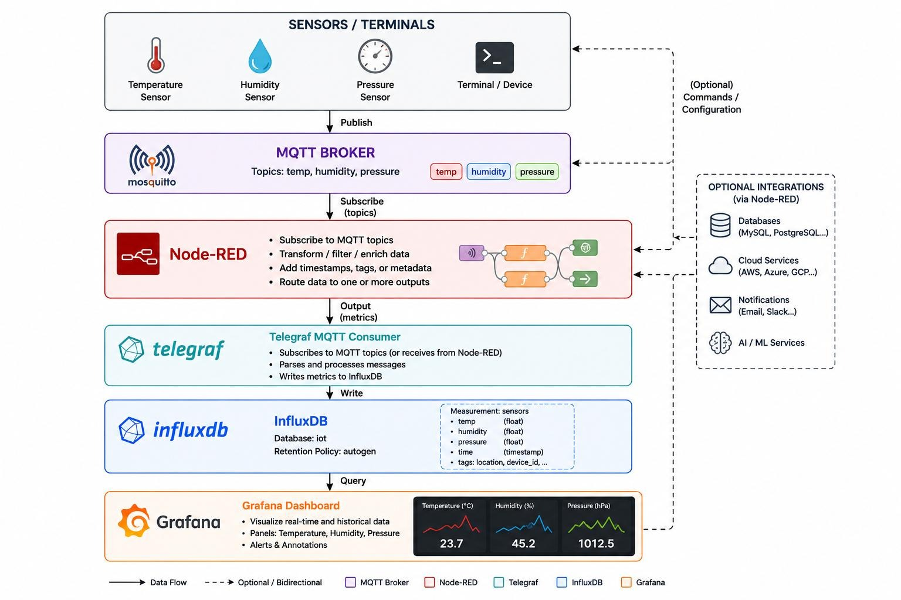

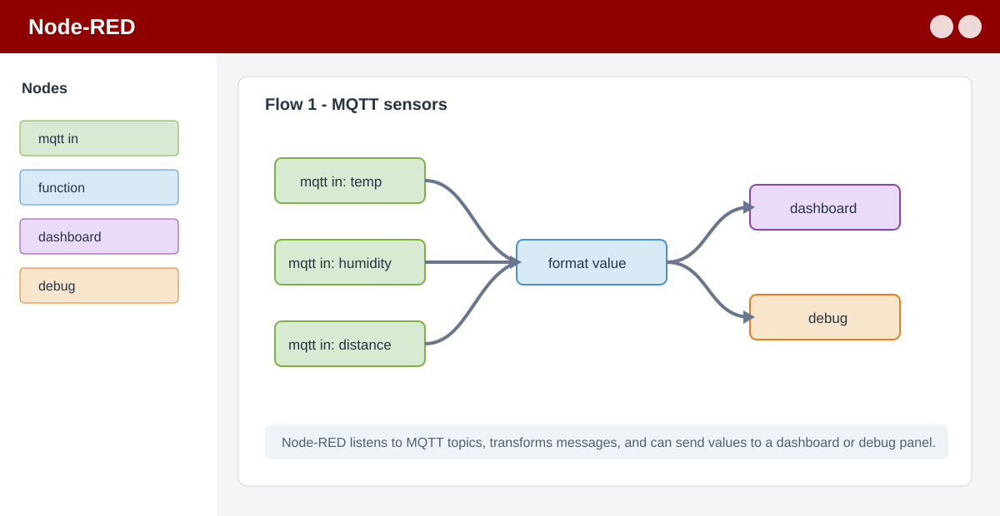

Node-RED peut se connecter au broker MQTT et s’abonner aux mêmes topics que ceux utilisés dans l’atelier :

- `temp`
- `humidity`
- `distance`
- `object`

Activités possibles avec Node-RED :

- S’abonner aux topics MQTT des capteurs et afficher les dernières valeurs.
- Ajouter une logique simple, par exemple vérifier si la distance est sous un seuil.
- Transformer les messages avant de les envoyer vers un autre service.
- Créer un tableau de bord léger pour une supervision rapide.
- Transférer certains messages MQTT vers une autre API ou un service de notification.

Exemple de flux :

```text
Entrée MQTT -> nœud function -> nœud debug
```

Pour un flux avec tableau de bord :

```text
Entrée MQTT -> nœud gauge/chart -> tableau de bord Node-RED
```

Utilisez Node-RED seulement lorsque le tableau de bord Grafana principal fonctionne. Grafana reste l’outil principal de visualisation de l’atelier ; Node-RED est une extension pour l’automatisation visuelle et le prototypage rapide.
