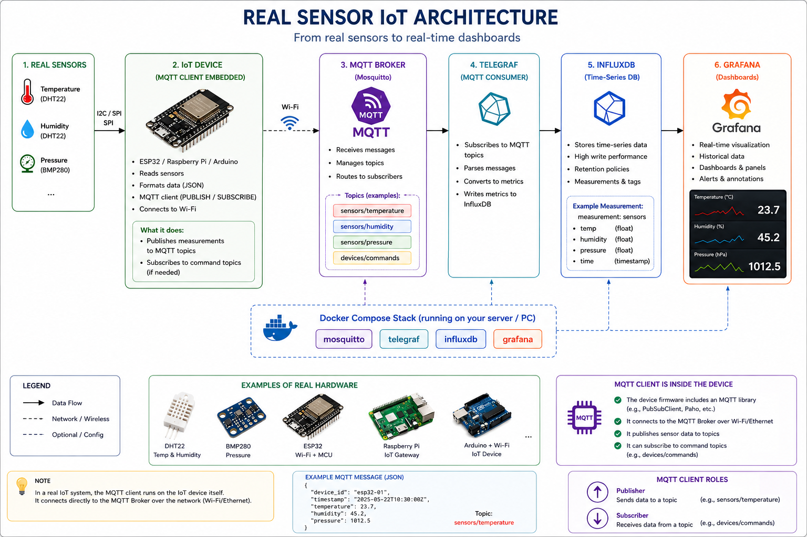

# Atelier IoT : MQTT, InfluxDB, Telegraf et Grafana

[Retour au README principal](README.md)

**Atelier 1 - Concevez votre 1re plateforme IoT**

Dans un système IoT, les capteurs produisent des mesures comme la température, l’humidité ou la pression. Cet atelier suit la chaîne complète de supervision :

1. Les capteurs produisent des mesures.
2. MQTT transporte les valeurs des capteurs.
3. Telegraf lit les messages MQTT.
4. InfluxDB stocke les mesures.
5. Grafana visualise les données dans des tableaux de bord.

## Objectifs

À la fin de l’atelier, les étudiants peuvent :

- Démarrer une pile IoT locale avec Podman Compose ou Docker Compose.
- Publier des données de capteurs vers un topic MQTT.
- Vérifier que les données sont stockées dans InfluxDB.
- Construire un tableau de bord Grafana de base.

## La Stack IoT

### MQTT (Mosquitto) - Transport Des Données IoT

MQTT est un protocole de communication léger très utilisé en IoT. Il fonctionne avec le modèle publish/subscribe :

- Les capteurs, ou notre simulateur Python, publient des messages sur un topic, par exemple `sensors/temperature`.
- D’autres applications s’abonnent à ce topic pour recevoir les messages.
- Mosquitto est le broker MQTT : c’est le serveur qui reçoit les messages et les redistribue aux abonnés.

### InfluxDB - Stockage Des Séries Temporelles

Les mesures IoT arrivent sous forme de données qui évoluent dans le temps : une valeur associée à une date et une heure. InfluxDB est une base de données optimisée pour ce type de données, appelées séries temporelles.

Dans cet atelier, InfluxDB sert à :

- Stocker les mesures comme la température, l’humidité et la pression.
- Garder un historique des valeurs.
- Permettre des requêtes comme les moyennes, les maximums et l’analyse des tendances.

### Telegraf - Collecte De Données

Telegraf est un agent de collecte de données souvent utilisé avec InfluxDB. Son rôle est de récupérer automatiquement des mesures provenant de différentes sources, comme des capteurs, services, fichiers logs, métriques système CPU/RAM ou messages MQTT, puis de les envoyer vers InfluxDB dans le bon format.

Il simplifie l’intégration, standardise les données et permet d’ajouter facilement de nouvelles sources sans modifier toute l’application.

### Grafana - Visualisation Et Tableaux De Bord

Grafana est un outil de visualisation qui permet de créer des dashboards avec des graphiques en temps réel, des courbes historiques et des alertes, par exemple lorsque la température dépasse `30 °C`.

## Architecture

### Architecture simplifiée


### Architecture détaillée


### Architecture IoT avec capteurs réels



```text
Capteur ou terminal
      |
      v
Broker MQTT : topics temp, humidity, pressure
      |
      v
Telegraf mqtt_consumer
      |
      v
Base InfluxDB : iot
      |
      v
Tableau de bord Grafana
```

## Rôles Des Composants

- MQTT : reçoit les messages des capteurs sur des topics comme `temp`, `humidity` et `pressure`.
- Client MQTT : fournit `mosquitto_pub` et `mosquitto_sub` dans la stack Compose, afin que les étudiants n’aient pas à installer les outils MQTT localement.
- Telegraf : s’abonne aux topics MQTT et envoie les valeurs numériques vers InfluxDB.
- InfluxDB : stocke les valeurs des capteurs sous forme de séries temporelles.
- Grafana : interroge InfluxDB et affiche les tableaux de bord.
- Node-RED : outil optionnel pour étendre l’atelier avec des flux visuels IoT.

## Fichiers

- `compose.yaml` : démarre Mosquitto, le client MQTT, InfluxDB, Telegraf et Grafana.
- `config/mosquitto/mosquitto.conf` : autorise les connexions MQTT anonymes locales pour l’atelier.
- `config/telegraf/telegraf.conf` : s’abonne aux topics MQTT `temp`, `humidity` et `pressure`, puis écrit les valeurs dans InfluxDB.
- `grafana/dashboards/iot-dashboard.json` : tableau de bord prêt à importer dans Grafana.
- `docs/images/` : contient les figures et captures d’écran du README.
- `scripts/setup.sh` : démarre la pile.
- `archive/` : conserve les anciens exemples limités à la température.

## Prérequis

Choisissez un environnement de conteneurs avant de commencer l’atelier :

- Podman Desktop avec Podman Compose, ou
- Docker Desktop avec Docker Compose.

Liens d’installation utiles :

- Podman Desktop : <https://podman.io/docs/installation>
- Podman Compose : <https://podman-desktop.io/docs/compose/setting-up-compose>
- Docker Desktop : <https://docs.docker.com/desktop/>
- Docker Compose : <https://docs.docker.com/compose/install/>
- Optionnel, Visual Studio Code : <https://code.visualstudio.com/download>

### Option Podman

Installez Podman et Podman Compose. Sur macOS, vous pouvez aussi utiliser Homebrew :

```bash
brew install podman podman-compose
```

Démarrez la machine virtuelle Podman :

```bash
podman machine init
podman machine start
```

Si la machine existe déjà, exécutez seulement :

```bash
podman machine start
```

Vérifiez Podman :

```bash
podman info
podman-compose --version
```

Sur Windows :

1. Installez Podman Desktop pour Windows.
2. Suivez le guide de configuration de Podman Compose indiqué dans les liens ci-dessus.
3. Ouvrez PowerShell, Windows Terminal ou le terminal de VS Code.
4. Exécutez les mêmes commandes Podman que celles indiquées dans cet atelier.

Vérifiez Podman depuis PowerShell :

```powershell
podman info
podman-compose --version
```

### Option Docker

Installez Docker Desktop, puis vérifiez :

```bash
docker compose version
```

Sur Windows :

1. Installez Docker Desktop pour Windows.
2. Utilisez le backend WSL 2 lorsque Docker Desktop demande le moteur d’exécution.
3. Ouvrez PowerShell, Windows Terminal ou le terminal de VS Code.
4. Exécutez les mêmes commandes Docker Compose que celles indiquées dans cet atelier.

Vérifiez Docker depuis PowerShell :

```powershell
docker compose version
docker version
```

### Outils Client MQTT

Aucune installation locale d’un client MQTT n’est requise. La stack Compose inclut un conteneur `mqtt-client` basé sur l’image Mosquitto. Les commandes `mosquitto_pub` et `mosquitto_sub` sont donc disponibles avec Podman Compose ou Docker Compose sur macOS, Windows et Linux.

## Option A : Podman Compose

### Étape 1 : Démarrer La Pile

Depuis ce dossier :

```bash
podman-compose up -d
```

Vérifiez que les conteneurs sont en cours d’exécution :

```bash
podman-compose ps
```

Services attendus :

- `mqtt-broker`
- `mqtt-client`
- `influxdb`
- `telegraf`
- `grafana`

Si vous utilisez Podman, Telegraf devrait apparaître comme actif. S’il est arrêté, consultez la section dépannage pour le correctif `setpriv`.

Si la pile était déjà en cours d’exécution avant une modification de `config/telegraf/telegraf.conf`, recréez Telegraf pour charger les nouveaux topics :

```bash
podman-compose up -d --force-recreate telegraf
```

### Étape 2 : Publier Des Données MQTT

Envoyer une valeur de température avec le conteneur client MQTT :

```bash
podman-compose exec mqtt-client mosquitto_pub -h mqtt-broker -p 1883 -t temp -m "25"
```

Envoyer plusieurs valeurs :

```bash
podman-compose exec mqtt-client mosquitto_pub -h mqtt-broker -p 1883 -t temp -m "22.5"
podman-compose exec mqtt-client mosquitto_pub -h mqtt-broker -p 1883 -t humidity -m "58"
podman-compose exec mqtt-client mosquitto_pub -h mqtt-broker -p 1883 -t pressure -m "1013"
```

Optionnel : s’abonner dans un autre terminal pour observer les messages :

```bash
podman-compose exec mqtt-client mosquitto_sub -h mqtt-broker -p 1883 -t temp
```

Après la publication d’une valeur, Telegraf devrait l’écrire dans InfluxDB après quelques secondes.

### Étape 3 : Vérifier InfluxDB

Ouvrez le shell InfluxDB :

```bash
podman-compose exec influxdb influx
```

Exécutez :

```sql
USE iot
SHOW MEASUREMENTS
SELECT * FROM mqtt_consumer ORDER BY time DESC LIMIT 5
```

Vous devriez voir les valeurs publiées sur les topics MQTT `temp`, `humidity` et `pressure`.

Quittez le shell :

```sql
exit
```

Vous pouvez aussi faire la vérification en une seule commande :

```bash
podman-compose exec influxdb influx -database iot -execute 'SELECT * FROM mqtt_consumer ORDER BY time DESC LIMIT 10'
```

## Option B : Docker Compose

### Étape 1 : Démarrer La Pile

Depuis ce dossier :

```bash
docker compose up -d
```

Vérifiez que les conteneurs sont en cours d’exécution :

```bash
docker compose ps
```

Services attendus :

- `mqtt-broker`
- `mqtt-client`
- `influxdb`
- `telegraf`
- `grafana`

Si la pile était déjà en cours d’exécution avant une modification de `config/telegraf/telegraf.conf`, recréez Telegraf pour charger les nouveaux topics :

```bash
docker compose up -d --force-recreate telegraf
```

### Étape 2 : Publier Des Données MQTT

Envoyer une valeur de température avec le conteneur client MQTT :

```bash
docker compose exec mqtt-client mosquitto_pub -h mqtt-broker -p 1883 -t temp -m "25"
```

Envoyer plusieurs valeurs :

```bash
docker compose exec mqtt-client mosquitto_pub -h mqtt-broker -p 1883 -t temp -m "22.5"
docker compose exec mqtt-client mosquitto_pub -h mqtt-broker -p 1883 -t humidity -m "58"
docker compose exec mqtt-client mosquitto_pub -h mqtt-broker -p 1883 -t pressure -m "1013"
```

Optionnel : s’abonner dans un autre terminal pour observer les messages :

```bash
docker compose exec mqtt-client mosquitto_sub -h mqtt-broker -p 1883 -t temp
```

Après la publication d’une valeur, Telegraf devrait l’écrire dans InfluxDB après quelques secondes.

### Étape 3 : Vérifier InfluxDB

Ouvrez le shell InfluxDB :

```bash
docker compose exec influxdb influx
```

Exécutez :

```sql
USE iot
SHOW MEASUREMENTS
SELECT * FROM mqtt_consumer ORDER BY time DESC LIMIT 5
```

Vous devriez voir les valeurs publiées sur les topics MQTT `temp`, `humidity` et `pressure`.

Quittez le shell :

```sql
exit
```

Vous pouvez aussi faire la vérification en une seule commande :

```bash
docker compose exec influxdb influx -database iot -execute 'SELECT * FROM mqtt_consumer ORDER BY time DESC LIMIT 10'
```

## Étape 4 : Configurer Grafana

Ouvrez Grafana :

```text
http://localhost:3000
```

Connexion :

```text
Username: admin
Password: admin
```

Grafana peut demander de changer le mot de passe. Pour un atelier en classe, vous pouvez l’ignorer.

Ajoutez une source de données InfluxDB :

1. Dans le menu de gauche, ouvrez `Connections`.
2. Cliquez sur `Data sources`.
3. Cliquez sur `Add new data source`.
4. Sélectionnez `InfluxDB`.
5. Remplissez les champs ci-dessous.

- Type : `InfluxDB`
- Query language : `InfluxQL`
- URL : `http://influxdb:8086`
- Database : `iot`
- User : laissez vide
- Password : laissez vide

Cliquez sur `Save & test`.

Important : utilisez `http://influxdb:8086` seulement dans Grafana. Grafana s’exécute dans le même réseau de conteneurs qu’InfluxDB, donc il peut joindre le service `influxdb`. Depuis votre navigateur ou votre terminal sur la machine hôte, utilisez plutôt `localhost:8086`.

Pour tester InfluxDB depuis votre terminal :

```bash
curl -i http://localhost:8086/ping
```

Une instance InfluxDB fonctionnelle retourne généralement :

```text
HTTP/1.1 204 No Content
```

## Étape 5 : Importer Le Tableau De Bord Prêt À L’emploi

Grafana peut importer le tableau de bord depuis `grafana/dashboards/iot-dashboard.json`.

Dans Grafana :

1. Ouvrez `Dashboards`.
2. Cliquez sur `New`.
3. Cliquez sur `Import`.
4. Téléversez `grafana/dashboards/iot-dashboard.json`.
5. Sélectionnez la source de données InfluxDB créée à l’étape 4.
6. Cliquez sur `Import`.

Le tableau de bord importé contient :

- Les valeurs des capteurs dans le temps.
- La température courante.
- L’humidité courante.
- La pression courante.

Publiez de nouvelles valeurs MQTT et rafraîchissez le tableau de bord.

## Optionnel : Créer Un Tableau De Bord Manuellement

Créez un nouveau tableau de bord et ajoutez un panneau.

Utilisez cette requête InfluxQL :

```sql
SELECT mean("value") FROM "mqtt_consumer" WHERE $timeFilter GROUP BY time($__interval) fill(null)
```

Paramètres suggérés pour le panneau :

- Visualization : `Time series`
- Title : `Sensor Values`

Publiez de nouvelles valeurs MQTT et rafraîchissez le tableau de bord.

## Étape 6 : Arrêter La Pile

```bash
podman-compose down
```

Si vous utilisez Docker Compose :

```bash
docker compose down
```

Pour supprimer aussi les données stockées :

```bash
podman-compose down -v
docker compose down -v
```

## Dépannage

Si Grafana n’affiche pas de données :

### 1. Vérifier Que Les Conteneurs Sont En Cours D’exécution

Avec Docker Compose :

```bash
docker compose ps
```

Avec Podman Compose :

```bash
podman-compose ps
```

Services attendus :

- `mqtt-broker`
- `mqtt-client`
- `influxdb`
- `telegraf`
- `grafana`

Si `telegraf` est arrêté, vérifiez ses logs :

```bash
docker compose logs telegraf
```

### 2. Confirmer Que Les Messages MQTT Atteignent Les Topics Des Capteurs

Ouvrez un terminal et abonnez-vous à tous les topics MQTT :

```bash
docker compose exec mqtt-client mosquitto_sub -h mqtt-broker -p 1883 -t '#' -v
```

Ouvrez un autre terminal et publiez des valeurs :

```bash
docker compose exec mqtt-client mosquitto_pub -h mqtt-broker -p 1883 -t temp -m "25"
docker compose exec mqtt-client mosquitto_pub -h mqtt-broker -p 1883 -t humidity -m "58"
docker compose exec mqtt-client mosquitto_pub -h mqtt-broker -p 1883 -t pressure -m "1013"
```

Sortie attendue dans le terminal abonné :

```text
temp 25
humidity 58
pressure 1013
```

Si vous voyez ces messages, MQTT fonctionne.

### 3. Confirmer Que Les Valeurs Sont Des Nombres Valides

Telegraf est configuré avec :

```toml
data_format = "value"
data_type = "float"
```

Cela signifie que la charge utile MQTT doit être uniquement un nombre.

Charges utiles valides :

```text
25
22.5
30.1
```

Charges utiles invalides :

```text
temperature=25
{"temperature":25}
25 C
```

Publiez une valeur de test valide :

```bash
docker compose exec mqtt-client mosquitto_pub -h mqtt-broker -p 1883 -t temp -m "25.5"
docker compose exec mqtt-client mosquitto_pub -h mqtt-broker -p 1883 -t humidity -m "58"
docker compose exec mqtt-client mosquitto_pub -h mqtt-broker -p 1883 -t pressure -m "1013"
```

### 4. Confirmer Qu’InfluxDB Contient Des Données

```bash
docker compose exec influxdb influx -database iot -execute 'SELECT * FROM mqtt_consumer ORDER BY time DESC LIMIT 10'
```

La sortie attendue contient des lignes avec une colonne `value` :

```text
name: mqtt_consumer
time                topic value
----                ----- -----
...                 temp  25.5
...                 humidity 58
...                 pressure 1013
```

S’il n’y a pas de données, redémarrez Telegraf et publiez à nouveau :

```bash
docker compose restart telegraf
docker compose exec mqtt-client mosquitto_pub -h mqtt-broker -p 1883 -t temp -m "26"
docker compose exec mqtt-client mosquitto_pub -h mqtt-broker -p 1883 -t humidity -m "60"
docker compose exec mqtt-client mosquitto_pub -h mqtt-broker -p 1883 -t pressure -m "1012"
```

Puis vérifiez encore InfluxDB :

```bash
docker compose exec influxdb influx -database iot -execute 'SELECT * FROM mqtt_consumer ORDER BY time DESC LIMIT 10'
```

### 5. Vérifier Les Logs Telegraf

Avec Docker :

```bash
docker compose logs telegraf
```

Avec Podman :

```bash
podman-compose logs telegraf
```

Si les logs Telegraf affichent cette erreur Podman :

```text
setpriv: failed to execute telegraf: Operation not permitted
```

Assurez-vous que le service `telegraf` dans `compose.yaml` contient :

```yaml
user: telegraf
```

Puis recréez Telegraf :

```bash
podman-compose up -d --force-recreate telegraf
```

### 6. Confirmer Les Paramètres De La Source De Données Grafana

Dans Grafana, ouvrez :

```text
Connections > Data sources > InfluxDB
```

Confirmez ces valeurs :

- Query language : `InfluxQL`
- URL : `http://influxdb:8086`
- Database : `iot`
- User : vide
- Password : vide

Cliquez sur `Save & test`.

Important : `http://influxdb:8086` est seulement pour Grafana. N’ouvrez pas cette URL dans votre navigateur.

### 7. Tester La Requête Dans Grafana Explore

Ouvrez :

```text
Explore
```

Sélectionnez la source de données InfluxDB et exécutez :

```sql
SELECT * FROM "mqtt_consumer" WHERE $timeFilter
```

Si Explore affiche des données mais que le tableau de bord n’en affiche pas, réimportez `grafana/dashboards/iot-dashboard.json` et sélectionnez la bonne source de données InfluxDB pendant l’import.

### 8. Vérifier Les Conflits De Ports

Si les ports sont déjà utilisés, arrêtez le service en conflit ou changez ces ports dans `compose.yaml` :

- MQTT : `1883`
- InfluxDB : `8086`
- Grafana : `3000`

Vérifiez les services exposés depuis l’hôte :

```bash
curl -i http://localhost:8086/ping
```

Réponse InfluxDB attendue :

```text
HTTP/1.1 204 No Content
```

Si `scripts/setup.sh` échoue, exécutez :

```bash
docker compose up -d
```

ou :

```bash
podman-compose up -d
```

## Résumé Des Commandes

| Tâche | Podman Compose | Docker Compose |
| --- | --- | --- |
| Démarrer la pile | `podman-compose up -d` | `docker compose up -d` |
| Vérifier les conteneurs | `podman-compose ps` | `docker compose ps` |
| Publier la température | `podman-compose exec mqtt-client mosquitto_pub -h mqtt-broker -p 1883 -t temp -m "25"` | `docker compose exec mqtt-client mosquitto_pub -h mqtt-broker -p 1883 -t temp -m "25"` |
| Publier l’humidité | `podman-compose exec mqtt-client mosquitto_pub -h mqtt-broker -p 1883 -t humidity -m "58"` | `docker compose exec mqtt-client mosquitto_pub -h mqtt-broker -p 1883 -t humidity -m "58"` |
| Publier la pression | `podman-compose exec mqtt-client mosquitto_pub -h mqtt-broker -p 1883 -t pressure -m "1013"` | `docker compose exec mqtt-client mosquitto_pub -h mqtt-broker -p 1883 -t pressure -m "1013"` |
| S’abonner à un topic | `podman-compose exec mqtt-client mosquitto_sub -h mqtt-broker -p 1883 -t temp` | `docker compose exec mqtt-client mosquitto_sub -h mqtt-broker -p 1883 -t temp` |
| Interroger InfluxDB | `podman-compose exec influxdb influx -database iot -execute 'SELECT * FROM mqtt_consumer ORDER BY time DESC LIMIT 10'` | `docker compose exec influxdb influx -database iot -execute 'SELECT * FROM mqtt_consumer ORDER BY time DESC LIMIT 10'` |
| Recréer Telegraf | `podman-compose up -d --force-recreate telegraf` | `docker compose up -d --force-recreate telegraf` |
| Voir les logs Telegraf | `podman-compose logs telegraf` | `docker compose logs telegraf` |
| Arrêter la pile | `podman-compose down` | `docker compose down` |
| Arrêter et supprimer les données | `podman-compose down -v` | `docker compose down -v` |

## Optionnel : Extension Avec Node-RED


