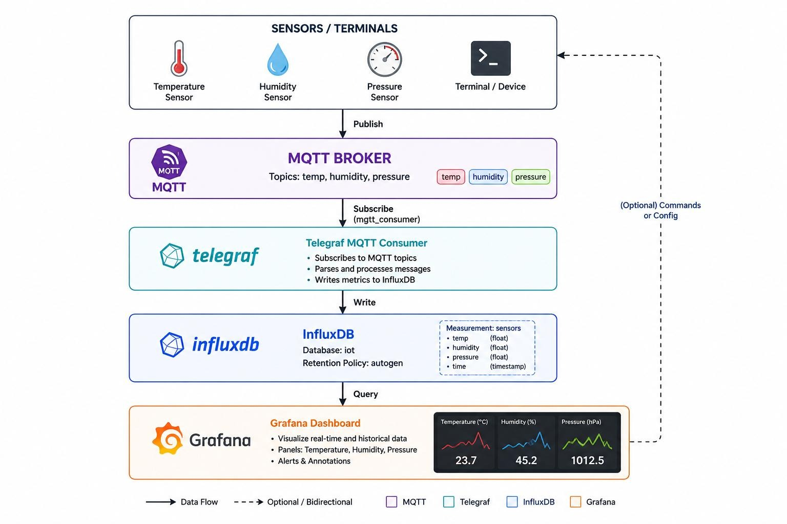

# SDJ IoT Workshop

Workshop SDJ for building a complete local IoT monitoring stack with MQTT, Telegraf, InfluxDB, and Grafana.

Choose a language:

- [English README](README.en.md)
- [README en francais](README.fr.md)

## Architecture

